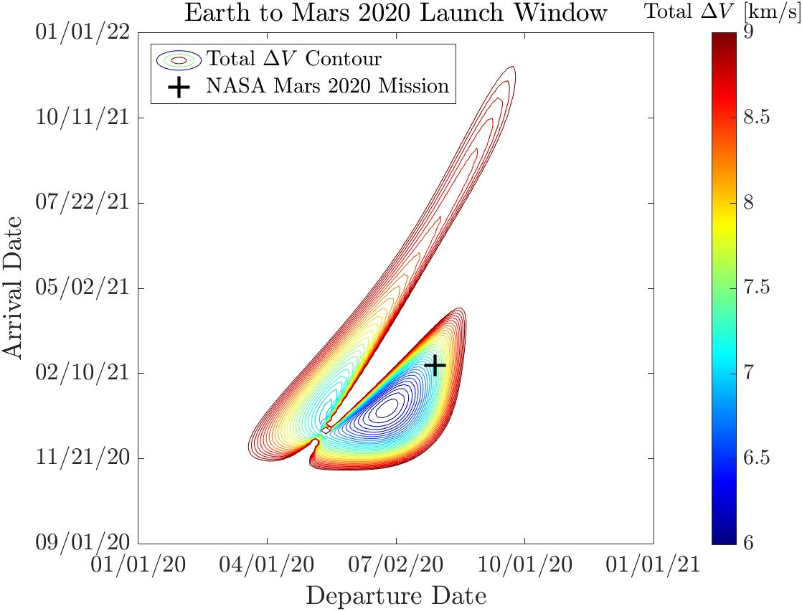

# Porkchop Plot Generator
[Github link](https://github.com/jeremyengels/interplanetary-porkchop)

### Introduction

A porkchop plot is a tool used by mission designers to calculate the best time to launch an interplanetary spacecraft. These plots are a simple concept — for a range of departure dates (e.g. from Earth) and arrival dates (e.g. to Mars) simply plot the total $$\Delta V$$ required for the departure and arrival burns at each pair of departure and arrival dates.

However despite the simplicity there is quite a lot of computation under the hood that is necessary to generate these plots. Namely, at each departure and arrival date pair, the ephemerides of both planets must be known, and then Lambert's problem must be solved to calculate a transfer trajectory. 

I was fascinated by these plots so I sought out to generate them myself.

### Propagating Planetary Orbits 

JPL publishes high-fidelity planetary ephemeris data that is open for anyone to use, but for the sake of this project I wanted to code my own orbit propagator. This of course reduces accuracy, but I wanted to make sure I knew enough orbital mechanics, and various epoch and reference frame conventions to be able to write my own. 

For this first iteration I assumed no perturbations, so each planet has constant orbital elements. I used the J2000 mean orbital elements [published by NASA](https://nssdc.gsfc.nasa.gov/planetary/planetfact.html), to do my orbit propagation. 

From there, the algorithm is relatively straightforward. Calculate the mean anomaly at a desired time:

$$ M = M_{J2000} + \frac{2\pi}{T}(t - t_{J2000}), $$

solve Kelper's equation for the eccentric anomaly:

$$ E - e\sin(E) = M, $$

and then calculate the true anomaly:

$$ \theta = 2\tan^{-1} \left(\tan \left( \frac{E}{2} \right) \sqrt{\frac{1+e}{1-e}}\ \right).$$

From here it's simple to calculate the body's position and velocity in perifocal coordinate frame, and then transform to heliocentric equatorial frame. 

$$
\begin{align}
	r_{PF} &= \frac{h^2}{\mu\ (1 + e\cos\theta)}\ \begin{bmatrix} \cos\theta & \sin\theta & 0  \end{bmatrix}^T \\
	v_{PF} &= \frac{\mu}{h}\  \begin{bmatrix} -\sin\theta & (e + \cos\theta) & 0 \end{bmatrix}^T
\end{align}
$$

### Solving Lambert's Problem 

Lambert's problem is the problem of fitting an orbit to two position measurements with a known time between them. There are many algorithms used to solve this. I opted to use [Izzo's Algorithm](https://arxiv.org/pdf/1403.2705.pdf) for its speed and robustness. It was already implemented in MATLAB [here](https://www.mathworks.com/matlabcentral/fileexchange/26348-robust-solver-for-lambert-s-orbital-boundary-value-problem) so I decided to use that. 

Lambert's problem, once solved, returns the $$\Delta V$$ required to enter the transfer orbit from the planet of origin, and the $$\Delta V$$ required to enter the destination orbit from the transfer orbit. 

To form the porkchop plot, these two $$\Delta V$$'s can either be summed and plotted, or plotted separately, as shown below.

### Results: Earth to Mars 2020 Window

With this generator my first idea was to plot the 2020 launch window from Earth to Mars, and compare my results to the NASA Mars 2020 Mission dates. This porkchop plot is shown below.

  

As you can see it's pretty good! The M2020 mission launches within a couple weeks of the minimum calculated $$\Delta V$$ transfer. And as you get further and further from this minimum-energy point the required $$\Delta V$$ to perform the maneuver increases dramatically. 

I believe that the reason that my plot does not have a minimum closer to the M2020 mission, is the constant orbital element assumption I made in the orbital propagator. The orbits of Mars and Earth are both perturbed by other bodies in the solar system, and as such the orbital elements vary pretty significantly over many years. 